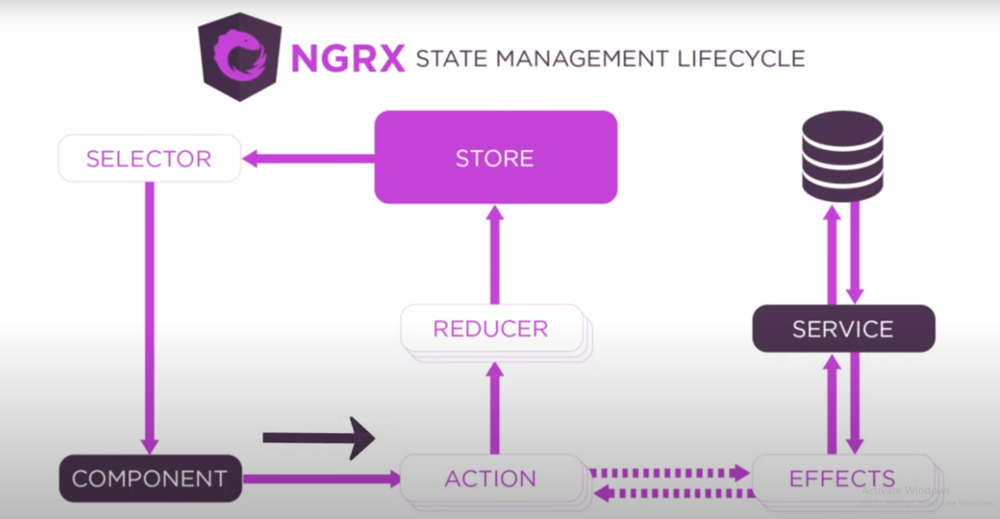

## NGRX Building blocks

1. Store
2. Actions
3. Reducers
4. Selectors
5. Effects

1. **Store**: A centralized state container that holds the application's state and serves as a single source of truth.
2. **Actions**: Represent unique events in the application, such as user interactions or API responses, that trigger state changes.
3. **Reducers**: Pure functions that take the current state and an action to compute and return a new state.
4. **Selectors**: Functions used to extract specific slices of state for use in components.
5. **Effects**: Handle side effects like API calls or complex logic outside of reducers, ensuring clean state management.

## Installations

**ng add @ngrx/store@18.1.1**
It downloads store package and imports StoreModule.forRoot() in App.module.ts

**npm i @ngrx/effects@18.1.1**
It downloads effects package
Import EffectsModule manually in App Module and list down all the effects in the list

**npm i @ngrx/store-devtools@18.1.1**
It downloads the devtools package .

**Install redux dev tools in chrome extension**
This is used for debug in the dev tools

**Note**
If you are getting an error stating Actions are not defined, add the below settings in tsconfig.json file
"compilerOptions": {
"useDefineForClassFields": false
},
